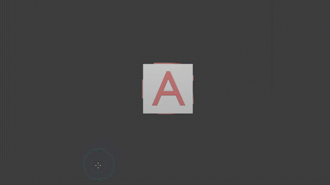
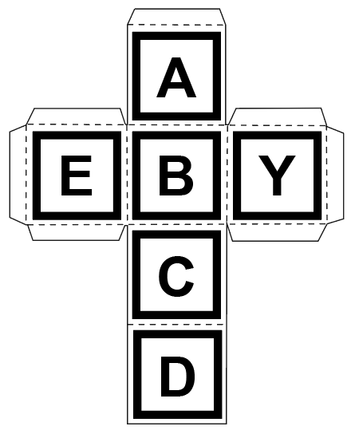
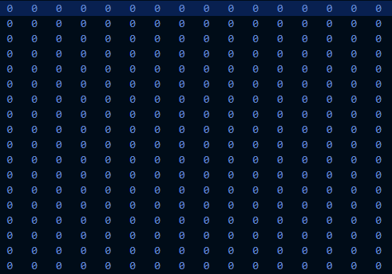
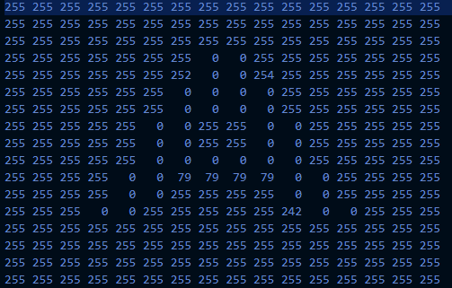

# Week 2 - Focus on Dev for Static Position Demo

## Overview

### Team Members

- Gray Assi: UX Lead
- Celine Nakpil: Programming Lead

### Timeline

26 January 2023 - 01 February 2023

### MVP Functions

- [x] Make the cube in blender with the raised letters on the sides
- [ ] Have the cube be persistent/exist on the screen independent of a qr code
- [x] Swap the image tag to use letters instead of hiro tags

### Stretch Goals

- [ ] Swap the blender cube into the current existing demo
- [ ] Prototype the custom AR.js events for basic rotation between two faces
- [ ] Figure out how to hide the live camera feed, either by covering it with another layer or removing it completely
- [ ] Track multiple tags on the camera at the same time

---

## Process

### Learning Blender

Put myself through a quick crash course in Blender to learn enough to make a 3D cube with embossed sides, matching to the paper cutout cube that Gray made. I actually really love the controls for Blender! Super intuitive once I got the hang of the hotkeys.

Then, I tried to figure out how to make a quick rotation animation for documentation and also general Blender knowledge purposes. That didn't end up working very well because I had modifiers on my object that wouldn't move with the animation and would have taken way too long to figure out for something so small. I made a .gif instead using OBS studio and Adobe Express.

### Creating Custom Markers

Since we need rotationally asymmetric markers that are also easily identified as unique from other faces for the paper cube, we chose to go with letters to denote the paper cube's orientation. Therefore, I needed to train AR.js to recognize the custom markers and also convert the letters on the cube template to actual markers.

AR markers (for my purposes and for the AR.js library) can be any image as long as it is not rotationally symmetrical. Thus, by choosing letters that are distinct in shape from one another and also rotationally asymmetrical, we can make a cube with distinct sides to both humans and the algorithm.

After using the tool to train AR.js, I have the required pattern files (.patt files) I need to program into the software that should track the custom letter markers on the cube.

### Issues with Custom Markers

For a few days, I banged my head against a wall trying to figure out why the custom tags weren't being sensed by the algorithm. Then I looked into the contents of the pattern files being generated by the AR.js Custom Marker Tool. Turns out there was a malfunction and it was only generating zeros instead of an actual pattern.

After a lot of sleuthing, I learned that the custom marker tool only works with .jpg files, and I had been uploading .png files. Compared to the previous failure, here is a functioning pattern file.

And now, the custom markers work! Unfortunately, troubleshooting this took up way too much time and I didn't get a chance to finish the making the tag a static tag, untracked by the camera. That goal has be added to next week's list of todos.

---

## Sources

- [How to Emboss a Blender Object](https://youtu.be/lc3d0pM2fpo)
- [Animate Rotating Object in Blender](https://youtu.be/6oXkRIN_t0Y)
- [Rotate an A-Frame Object](https://github.com/aframevr/aframe/blob/master/docs/components/rotation.md)
- [Create a Custom AR.js Marker](https://medium.com/arjs/how-to-create-your-own-marker-44becbec1105)
- [Train AR.js Custom Marker Tool](https://ar-js-org.github.io/AR.js/three.js/examples/marker-training/examples/generator.html)
